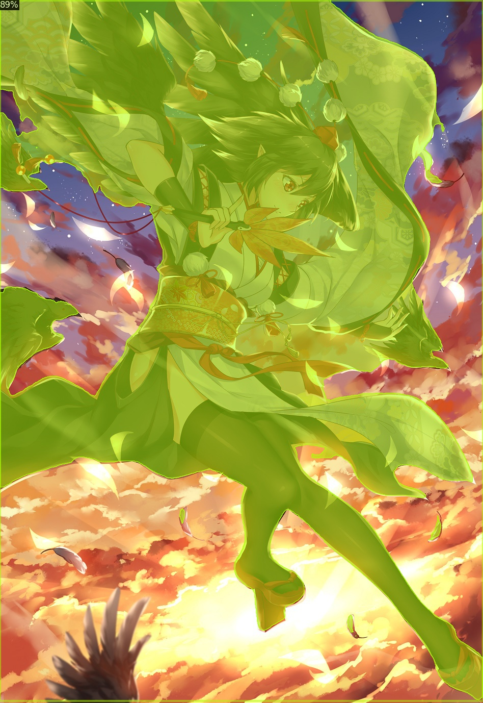
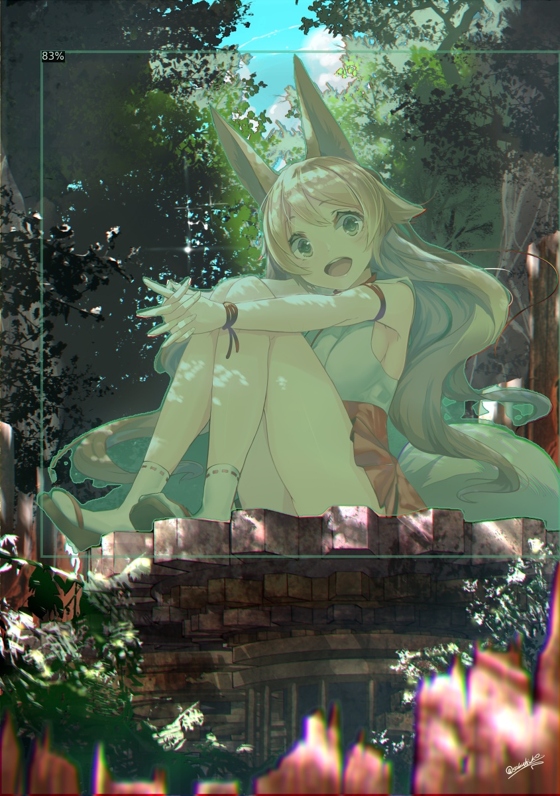

# Yet-Another-Anime-Segmenter
Instance segmentation for anime characters based on [CondInst](https://arxiv.org/abs/2003.05664), using the implementation from [AdelaiDet](https://github.com/aim-uofa/AdelaiDet) and [detectron2](https://github.com/facebookresearch/detectron2).

Many thanks to [AniSeg](https://github.com/jerryli27/AniSeg) created by jerryli27, as part of the dataset originates from the segmentation data provided in this [repo](https://github.com/jerryli27/AniSeg#about-the-models). The rest of the dataset is retrieved from [Pixiv](https://www.pixiv.net/) and manually annotated.

Newer version of the model is still under development, stay tuned if you are interested.

## Usage
### Installation
Both AdelaiDet and detectron2 are required. Please refer to the official guide from [AdelaiDet](https://github.com/aim-uofa/AdelaiDet#installation) and [detectron2](https://github.com/facebookresearch/detectron2/blob/master/INSTALL.md). A [Colab tutorial](https://github.com/zymk9/Yet-Another-Anime-Segmenter/blob/main/Anime_Segmentation.ipynb) is provided.

### Inference
1. Download the [pretrained model](https://drive.google.com/file/d/1-3S47uS4BSOdPmY0dKy99WA-DA7OUMq5/view?usp=sharing) and the [config file](https://github.com/zymk9/Yet-Another-Anime-Segmenter/blob/main/config.yaml).

2. Run inference with
   ```bash
    python AdelaiDet/demo/demo.py \
        --config-file path/to/config.yaml \
        --input input1.jpg input2.jpg \
        --opts MODEL.WEIGHTS path/to/pretrained/model
   ```
## Training and Results
Training using transfer learning from a [pretrained model](https://github.com/aim-uofa/AdelaiDet#coco-instance-segmentation-baselines-with-condinst) on COCO Instance Segmentation. Parameters can be found in the [config file](https://github.com/zymk9/Yet-Another-Anime-Segmenter/blob/main/config.yaml).

Dataset is augmented by placing segmentations on pure backgrounds.




